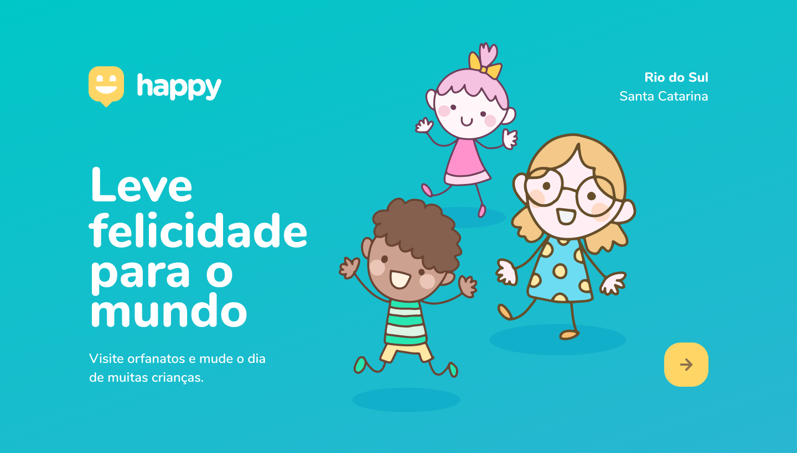

<div align="center">

  
  <h1 align="center">Happy</h1>
  <p>A Platform to connect you and the institutional shelters in your locality.</p>
  <p>This application was developed during  Rocketseat Next Level Week.</p>

  <span>
    <a href="project">Project</a> |
    <a href="tech">Technologies</a> |
    <a href="features">Features</a> |
    <a href="install">Install</a> |
    <a href="use">How to use</a> |
    <a href="license">License</a> |
  </span>
</div>

<h2 id="project">Project</h2>

<p>
Happy is an application to connect people and institutional shelters. Find one, pay a visit, and make the world a better place.
</p>
<p>
The NLW focused on children's shelters, but as my locality does not have this type of institution, I opted to open the scope and make it available also for elderly's shelters.
</p>
<p>
I used to visit the retirement home in my city. The elderly really appreciate it when people go visit and chat with them.
</p>


<h2 id="tech">Technologies</h2>
<ul>
  <li>React Native</li>
  <li>TypeScript</li>
  <li>Expo</li>
  <li>Google Maps</li>
</ul>

<h2 id="features">Features</h2>
<ul>
  <li>Find institutional shelters for children or the elderly on the map;</li>
  <li>Add shelters to the map;</li>
  <li>See detailed information about the shelter and instructions for visiting;</li>
  <li>Contact via whatsapp message;</li>
  <li>Access routes via Google Maps;</li>
</ul>

<h2 id="install">Install</h2>

```shell
# clone the project
git clone https://github.com/lorenasg1/nlw-happy-mobile.git

# install dependencies
yarn

# install expo app on your phone

```


<h2 id="how">How to use</h2>

```shell

# update the baseURL in src/services/api, use your computer ip address

# start the project
yarn start

# capture the qrcode with the expo app 
```

<h2 id="licence">Licence</h2>

<p>
This project is under <a href="">MIT </a>licence.
</p>
